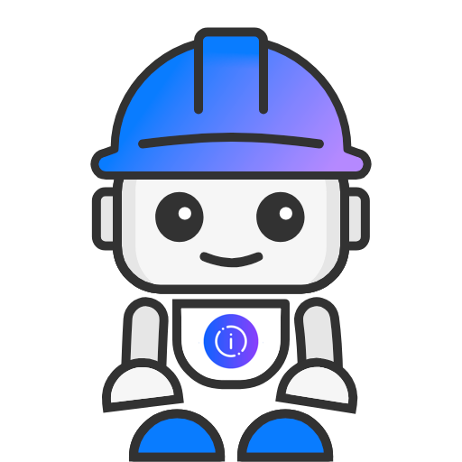
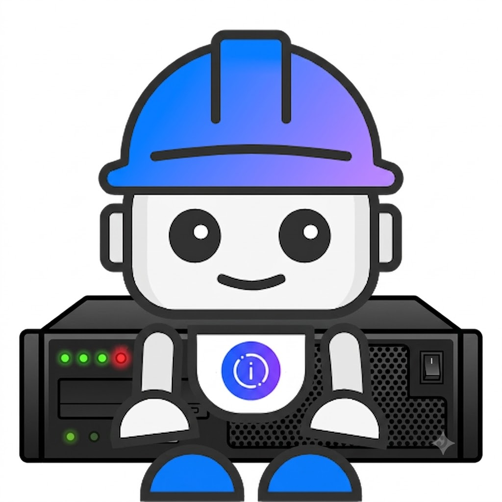
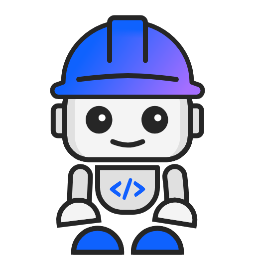

# IBM Bob and IBM i Workshop (Premium Package for i)

## Overview

Hands-on labs to learn IBM i modernization using IBM Bob AI assistant with the **Premium Package for i (PPi)**. Each lab focuses on one practical use case you can complete quickly.

<table>
<tr>

<td align="center" width="25%">
<a href="https://github.com/bmarolleau/flight400-demo/blob/main/README.md">

 
<strong>✈️ Flight400 + PPi</strong>
</a>
 
⭐ <em>Recommended!</em>⭐ 
Simple RPG/DDS app, source in QSYS — ideal for demos and half-day workshops. <b>Easy setup</b>
</td>

<td align="center" width="25%">
<a href="./lab100-premium-package-introduction.md">

 
<strong>SAMCO + PPi</strong>
</a>
 
Multi-language app (RPG, COBOL, CL, C, C++, DDS, SQL) — best for 3h+ workshops and customers with mixed-language codebases.
</td>

<td align="center" width="25%">
<a href="./lab200-premium-package-ops-sysadmin.md">

 
<strong>PPi for IBM i Ops / Sysadmins</strong>
</a>
 
Bob for Ops — Beyond the SDLC, Bob for IBM i troubleshooting and Power Systems operations
</td>

<td align="center" width="25%">
<a href="./lab01_ibm-bob-ibmi-labs.md">

 
<strong>Additional Bob & IBM i labs</strong>
</a>
 
Bonus exercises with minimal or no IBM i connection: Ansible/DevOps automation, IBM i MCP Server, Bob Shell.
</td>

</tr>
</table>

---

## ✈️ IBM Bob with Premium Package for i : End to End Demo (Flight400)

> This end-to-end Flight400 demo is intended for building and delivering client demonstrations. **Dear customer, demand your demo now ヅ !!** 

The **Flight400** demo showcases the full Premium Package for i experience on a simple but realistic IBM i application — from legacy green-screen RPG to a modern, AI-assisted development workflow. Use it as a live, story-driven reference to illustrate the value of Bob PPi. 

🔗 Repository: [flight400-demo](https://github.com/bmarolleau/flight400-demo/blob/main/README.md)

### Which application should I use?

| | Flight400 | SAMCO |
|---|---|---|
| **Best for** | Quick demos, half-day workshops, first PPi contact | 3h+ workshops, mixed-language apps |
| **Languages** | RPG (OPM/ILE), DDS | RPG, COBOL, CL, C, C++, DDS, SQL |
| **Code location** | Native IBM i libraries (QSYS) — direct PPi connection, no extra scripting | Local workspace / Git — requires setup scripts to sync to source members |
| **Setup** | Restore via SQL script, duplicate with `CPYLIB` per user | See [build instructions](./lab01_ibm-bob-ibmi-labs.md#building-the-application) |
| **Repo** | [flight400-demo](https://github.com/bmarolleau/flight400-demo) | this repo |

> **Flight400** lives natively in IBM i libraries — the primary PPi differentiator is that users connect directly to their IBM i source files from the Bob IDE, with no workspace sync required. This makes it the go-to choice for showing PPi features. For multi-user setups (shared LPAR), restore the app once then run `CPYLIB FROMLIB(FLGHT400) TOLIB(FLIGHT401)` (and so on) so each participant gets their own isolated copy.

---

> 💡 **Instructor notes:** Installation scripts are in the [setup directory](./setup/). SAMCO build instructions are [here](./lab00_ibm-bob-ibmi-labs.md#building-the-application). To get an IBM i virtual machine for testing, see [here](./lab4-ibmi-mcp-mode.md#how-to-get-an-ibm-i-virtual-machine-aka-lpar).
