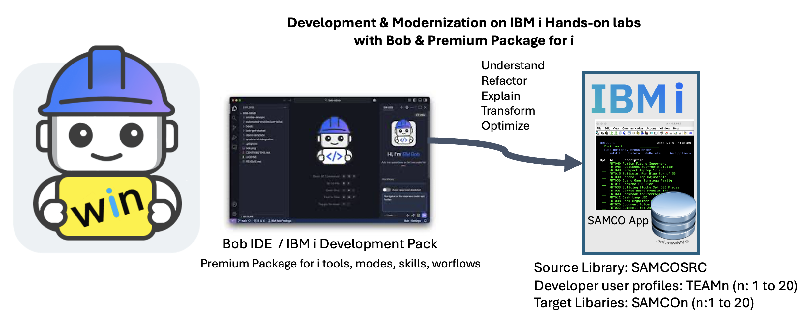
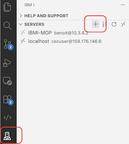
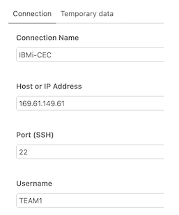
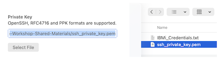
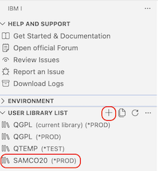

# Bob and IBM i workshop (Premium Package for i)

---

## 🎯 Mission: Modernisation

### Your Mission

As a member of the **development team**, your mission is to modernize your application and development practices — from green screen to a collaborative **Git / VS Code era with DevOps automation**. You are part of a **team of developers**, all onboarded on IBM Bob, all working on the same application.
Relax, IBM Bob is here to help ! 

With Premium Package for i, source, system or application artifacts can live on the system or in your local workspace/Git — your choice. Take benefits of the **built-in IBM i modes, rules, skills, workflows, and optimize your productivity.**

**Key general principles with Premium Package for i (PPi)**: Source can live in the **local workspace** or in **source files in QSYS**. When using PPi, you can keep your files in QSYS if you want to, and use Bob/PPi as an assistant while your developers still use SEU/PDM. **Just because you can doesn't mean you should!**.
We really encourage you to move your source files to the IFS and git, and use QSYS when it makes sense. 

---

## 🧪 IBM Bob with Premium Package for i : End to End Labs (SAMCO)

### SAMCO Environment



**Key principle in these Labs**: Source lives in the **local workspace** only. `SAMCOn` (n = team number)contains compiled programs, service programs, and database objects — no source members. `SAMSRCn` contains source files of the SAMCO application. In the rest of the labs, compiled objects always target `SAMCOn`.

**💡 Important Note**: Throughout the lab, you can start a new Bob task specifying a scope (workspace) using the **"+" button** at the top of the 'IBM Bob' Chat view: **1.local** workspace, **2.QSYS (Library list)**, or **3.IFS**. Most exercises can be run in either scope with the appropriate preparation. The behavior of the tool will be slightly different: **experiment and decide!**

The SAMCO application and database have already been built in your `SAMCOn` library so initally you don't have to build it. During the lab, you may need to modify the source code, and if you wish, you can recompile it, here using the Tobi (makei) tool. Of course, in your day to day developer activity, other build tools or scripts could be used. 

| What | Where |
|------|-------|
| **Source code** | Local workspace — your Git clone on your workstation (IFS-synchronized). **This is the only place source is edited.** |
| **Your workspace** | Your own clone of the shared Git repository — Bob reads and writes local files directly |
| **Compiled objects & database** | Built and stored in **`SAMCOn`** on IBM i — where `n` is your team number (e.g., `SAMCO1`, `SAMCO3`) |
| **Source Files** | **`SAMSRCn`** Libraries containing source members on IBM i — used **in Lab 101** for documentation generation and code understanding |

This collaborative setup means your changes stay isolated in your branch (and libraries) until you are ready to merge, while the rest of your team works in parallel.

---
## 📋 Labs Summary

| Lab | Title | Mode | Main Topic | Duration |
|-----|-------|------|------------|----------|
| [Lab 101](lab101-premium-discover-samco.md) | Document SAMCO with Bob | 💬 Ask | `read_member`, `search_qsys`, `/erd`, docs in `docs/` | 20 min |
| [Lab 102](lab102-premium-fixed-to-free.md) | Convert Fixed-Format RPG to Free | ℹ️ IBM i Developer | `convert_rpg_source`, **Fixed to Free Workflow**, RPG skills | 20 min |
| [Lab 103](lab103-premium-dds-to-sql-workflow.md) | Convert DDS to SQL | ℹ️ IBM i Developer | **DDS to SQL Skills**, `db2-dds-to-ddl`, `check_sql_syntax` | 20 min |
| [Lab 104](lab104-premium-rla-to-sql.md) | Convert RLA to SQL and Optimize | 🛢️ IBM i Database | `/erd`, `db2-sql-primer`, `db2-index-strategy` | 20 min |
| [Lab 105](lab105-premium-impact-analysis.md) | Analyze Impact and Extend a Field Across the Full Stack | ℹ️ IBM i Developer | `QSYS2.SYSDEP`, `ALTER TABLE`, `search_ifs`, `write_stream_file`, `dds-display-files`, `rpg-embedded-sql` , **Business Rules Extraction Workflow** | 35 min |
| [Lab 106](lab106-premium-test-rpgunit.md) | Generate RPGUnit Tests for SAMCO | ℹ️ IBM i Developer | `generate_rpg_unit_test_stub`, `run_rpg_unit_test_suite` , **RPGUnit Test Plan Workflows** | 20 min |
| | | | **Total Duration** | **~2 h 15 min** |

---


## 🛠️ Lab Environment Setup

### a. (Optional) Get an IBM i Virtual Machine

> Skip this if your instructor has already provided an IBM i system.

If you need your own IBM i LPAR, the recommended option is **IBM i on IBM Cloud Power Virtual Server (PowerVS)** via TechZone:
- [Request IBM i on PowerVS](https://techzone.ibm.com/collection/628be988043b54001f89111f) — available for customers, IBMers, and Business Partners.
- If the system has a public IP, set up an SSH tunnel to reach it (see [instructions](https://cloud.ibm.com/docs/power-iaas?topic=power-iaas-connect-ibmi#ssh-tunneling)); your instructor will share the exact command.

### b. Install & Start IBM Bob IDE

1. Download and install **Bob IDE** (VS Code-based).
2. Launch Bob IDE and sign in with your **IBM ID** — if you don't have an account, inform your instructor before the lab.
3. Install the **Bob Premium Package for i**  *(PPi `.vsix` in the marketplace)*  that includes IBM i Developer & Database modes, tools, workflows, skills

### c. Install Code for IBM i Extension Pack

Install the following extensions from the VS Code Marketplace in not already installed:

| Extension |  Purpose |
|-----------|----------|
| **IBM i Development Pack**  | Includes a set of extensions for IBM i development |

> Refer to the [**Code for IBM i documentation**](https://codefori.github.io/docs/) if you have questions.
> If you installed PPi, verify the **Bob** chat panel opens and the **IBM i Developer** and **IBM i Database** modes are available in the mode selector.

### d. Connection to IBM i

1. In Bob IDE, open the **IBM i** panel (left sidebar).
2. Click **New Connection** and enter the **host IP, user profile, and password** provided by your instructor.

- **Establish the connection to your IBM i** this is a standard connection to your IBM i.

    
 
 Refer to the `Code for i` [QuickStart](https://codefori.github.io/docs/quickstart/) for more details.


- **(Optional) Establish an SSH tunnel when using IBM i on PVS** if you want to use a 5250 terminal session from your workstation. Only required if using IBM i on PowerVS (IBM Cloud) with a public IP. Please ask your instructor. (see instructions [here](https://cloud.ibm.com/docs/power-iaas?topic=power-iaas-connect-ibmi#ssh-tunneling , the instructor will share the command to run on your workstation).
- In the **Code for IBM i** object browser, browse library **`SAMSRCn`** — this contains the original source members (RPG, CL, DDS, SQL) for reference.
- Browse library **`SAMCOn`** (your team's library) — this contains compiled programs, objects, and the database.
- Launch **`GO SAMMNU`** on 5250 to explore the SAMCO application menu and understand the green-screen interface you will be modernizing.

### Library List


**Important Note**: Your job's library list must include `SAMCOx` so that compiled programs can find their files and service programs at runtime. **Ideally, in your Bob IDE, please make sure your Library List includes: `SAMCOn` , `SAMSRCn`**


```cl
ADDLIBLE LIB(SAMCOx)    /* compiled objects — replace x with your team number */
```

Set the library list in the **Code for IBM i** connection settings under *User Library List* . If needed please refer to the [documentation](https://codefori.github.io/docs/browsers/).



### e. Deploy and Build SAMCO on IBM i (Instructor / Self-hosted)

> **Audience**: Lab instructors or participants running their own IBM i. If `SAMCOn` and `SAMSRCn` libraries were already pre-provisioned by your instructor, you can skip this section.

The [`setup/`](setup/) directory contains three scripts that deploy, build, and replicate the SAMCO environment for every team member. Run them **once from IBM i PASE**, in order, or use `BUILD_ALL.sh` to run everything in a single shot.

| Script | Purpose |
|--------|---------|
| [`1_deploy_samco_src_to_qsys.sh`](setup/1_deploy_samco_src_to_qsys.sh) | Creates the `SAMSRCn` library, creates all source physical files, then copies every IFS source member into the matching QSYS source member |
| [`2_buildSAMCO.sh`](setup/2_buildSAMCO.sh) | Installs Tobi (`makei`) and Python 3.9, creates the `SAMCO` object library, runs `makei build`, and populates Db2 tables with sample data |
| [`3_copy_lib_n_times.sh`](setup/3_copy_lib_n_times.sh) | Clones `SAMCO` (and `SAMSRC`) into `SAMCO1`…`SAMCOn` (and `SAMSRC1`…`SAMSRCn`) using `CPYLIB` — one copy per team |
| [`BUILD_ALL.sh`](setup/BUILD_ALL.sh) | Orchestrates all three steps above in sequence |

**Step-by-step (manual)**:

**1. SSH to your IBM i and navigate to the setup directory:**
```bash
cd /home/YOURUSER/IBM-i-Application-Modernization-with-Bob/setup
```

**2. Deploy source to QSYS (creates `SAMSRC` library with all source members):**
```bash
bash 1_deploy_samco_src_to_qsys.sh --library SAMSRC
```
> Use `--dry-run` to preview without making changes.

**3. Build the SAMCO application (creates `SAMCO` object library):**
```bash
bash 2_buildSAMCO.sh
```
This installs Tobi, compiles all RPG/CL/DDS/SQL objects, and populates the database tables.

**4. Clone libraries for each team (e.g., for 25 participants):**
```bash
bash 3_copy_lib_n_times.sh --from SAMCO --range 1 25
bash 3_copy_lib_n_times.sh --from SAMSRC --range 1 25
```
This creates `SAMCO1`…`SAMCO25` and `SAMSRC1`…`SAMSRC25`, one isolated pair per team.

**Or run everything at once:**
```bash
bash BUILD_ALL.sh
```

**Quick reference — `3_copy_lib_n_times.sh` options:**

| Option | Description |
|--------|-------------|
| `--from <LIB>` | Source library to clone |
| `--range <m> <n>` | Inclusive range of numbered targets (e.g. `1 25`) |
| `--force` | Overwrite existing target libraries without prompting |
| `--dry-run` | Preview actions without executing |

 
---

## IBM i Developer Mode (ℹ️)

**Purpose**: Explain, generate, compile, document, test, and modernize IBM i code.

Bob acts as an expert in RPG (OPM and ILE), CL, DDS, SQL, and COBOL. When connected, your **library list, OS version, CCSID, and home directory** are automatically injected into every conversation.

| Tool category | Tools |
|---------------|-------|
| **Read** | `read_stream_file`, `search_ifs`, `read_member` (Lab 101 only), `search_qsys` |
| **Edit** | `write_stream_file` (local workspace) |
| **Execute** | `execute_cl_command`, `execute_sql_statement`, `check_sql_syntax`, `execute_pase_command` |
| **Build** | `get_compile_actions`, `execute_compile_action` |
| **Test** | `generate_rpg_unit_test_stub`, `run_rpg_unit_test_suite` |
| **Docs** | `fetch_cl_command_doc`, `search_sql_examples`, `fetch_sql_example`, `search_ibm_i_docs_with_rag` |

> **Guardrails**: Destructive CL (`DLT*`, `CHG*`, `CPY*`) and destructive SQL (`DROP`, `DELETE`, `INSERT`, `UPDATE`) require explicit user approval.

---

## IBM i Database Mode (🛢️)

**Purpose**: Generate, modernize, and tune SQL within Db2 for i.

**Used in**: [Lab 104](lab104-premium-rla-to-sql.md)

A database-expert mode focused on Db2 for i — SQL-first, with full awareness of DDS and CL realities. Includes all the same tools as IBM i Developer mode.

---

## Slash Commands

### `/erd` — Generate an Entity Relationship Diagram

```
/erd SAMCOx
/erd SAMCOx.ARTICLE
```

Queries the `QSYS2` catalog and generates a **Mermaid ERD** showing tables, columns, primary keys, and relationships. Available in both IBM i modes when connected.

**Used in**: [Lab 101](lab101-premium-discover-samco.md) · [Lab 104](lab104-premium-rla-to-sql.md)

---

## Workflows (non exhaustive list)


### Workflow 1 — Fixed to Free Conversion

Guided conversion of **fixed-format RPG to free-format RPG IV** — specification by specification (H→`Ctl-Opt`, F→`Dcl-F`, D→`Dcl-S`/`Dcl-Ds`, C→free-form), with a compile status table at the end.

**Used in**: [Lab 102](lab102-premium-fixed-to-free.md)

---

## Skills (Automatic)

Skills are loaded automatically by Bob based on what you ask — you do not invoke them.

### Db2 for i (15 skills)
`db2-sql-primer` · `db2-ddl-generation` · `db2-dds-to-ddl` · `db2-dds-understanding` · `db2-sql-optimization` · `db2-sql-performance-analysis` · `db2-sql-find-performance-data` · `db2-sql-debugging` · `db2-index-strategy` · `db2-journaling-commitment` · `db2-security-best-practices` · `db2-stored-procedures` · `db2-temporal-tables` · `db2-ccsid-encoding` · `db2-system-catalog`

### RPG (14 skills)
Fundamentals · Free-format · Data structures & indicators · Procedures & functions · Embedded SQL · OPM→ILE migration · Fixed→Free conversion · RLA→SQL · Legacy refactoring · Code review

### CL (1 skill) · DDS (4 skills)
`cl-primer-basics` · `dds-primer-basics` · `dds-physical-files` · `dds-logical-files` · `dds-display-files`

---

## Bob Core vs. Bob Premium Package for i

| Feature | Bob Core | Bob Premium Package for i |
|---------|----------|--------------------------|
| **Modes** | Custom modes via `.bob/custom_modes.yaml` | Built-in **IBM i Developer** ℹ️ and **IBM i Database** 🛢️ |
| **IBM i tools** | None | `read_stream_file`, `write_stream_file`, `search_ifs`, `read_member` (read-only), `search_qsys`, `execute_cl_command`, `execute_sql_statement`, `check_sql_syntax`, `convert_rpg_source`, and more |
| **Build & compile** | Not available | `get_compile_actions` + `execute_compile_action` |
| **Slash commands** | None | `/erd` — live Mermaid ERD from QSYS2 catalog |
| **Workflows** | Not available | DDS to SQL Conversion Impact Analysis · Fixed to Free Conversion |
| **Skills** | Manual `.bob/skills/` files | **34 skills auto-loaded** based on context |
| **RAG documentation** | Not available | `search_ibm_i_docs_with_rag` — semantic IBM i doc search |
| **Unit testing** | Not available | `generate_rpg_unit_test_stub` + `run_rpg_unit_test_suite` with code coverage |
| **Connection context** | Manual specification | Automatic injection (library list, OS version, CCSID) |
| **Guardrails** | None | Destructive command approval by default |

---

*Bob Premium Package for IBM i — Accelerating IBM i Modernization*
