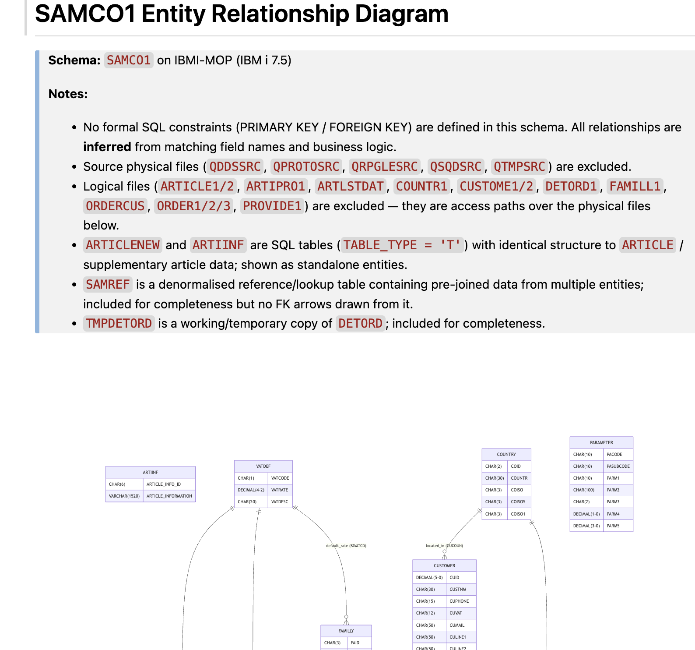
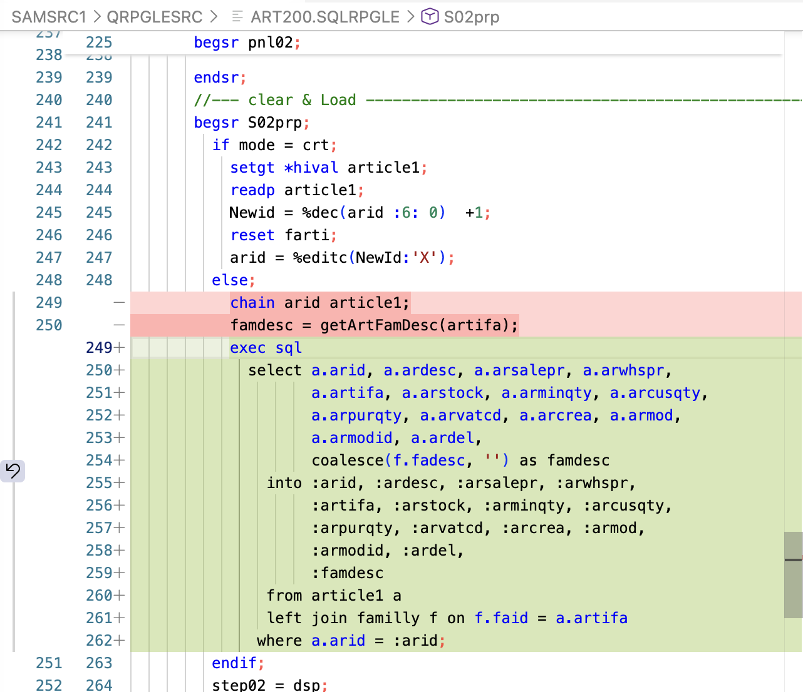

# Lab 104: Convert RLA to SQL and Optimize

## Overview
Use the **IBM i Database** mode to replace record-level access (RLA) operations with SQL and optimize query performance using Bob's SQL-first skills and index strategy guidance.

**Duration**: 15 minutes  
**Difficulty**: Intermediate  
**Mode**: 🛢️ IBM i Database  
**Source**: Local workspace (`SAMCO/QRPGLESRC/`)  
**Build target**: `SAMCOn`

> **Local workspace**: Source lives in the **local Git clone** exclusively. Bob edits local files with `write_stream_file`. SQL views and indexes are created in `SAMCOn` (which contains database objects and compiled programs — no source members).

---

## Prerequisites
- Bob IDE with **IBM Bob Premium Package for i** installed
- **Code for IBM i** extension connected to your IBM i system
- **Db2 for i** extension installed
- `SAMCOn` in your library list (`n` = your team number)
- [Lab 101](lab101-premium-discover-samco.md) and [Lab 103](lab103-premium-dds-to-sql-workflow.md) recommended

---

## Step 1: Switch to IBM i Database Mode and Generate ERD (3 minutes)

In the Bob chat panel, select **🛢️ IBM i Database** mode.

Run the `/erd` command:
```
/erd SAMCOn
```

**What to observe:**
- Bob queries `QSYS2.SYSTABLES`, `SYSCOLUMNS`, `SYSCST` and generates a **Mermaid ERD**
- Shows ARTICLE → FAMILLY (via ARFAMCOD) and ARTICLE → VATDEF (via ARVAT) relationships
- Auto-loads `db2-sql-primer`, `db2-sql-optimization`, `db2-index-strategy` skills
- Here with existing SAMCO, there are no SQL constraints defined in the catalog — these are DDS-era physical files with no formal referential integrity. The `/erd` command will build the column data needed to build the ERD from structural analysis.


---

## Step 2: Convert CHAIN Operations to a Single SQL JOIN (4 minutes)

The `ART200` program currently uses two sequential operations:
1. `CHAIN arid article1` — fetch article record
2. `getArtFamDesc()` — calls a procedure to CHAIN into FAMILLY

**Prompt:**
```
Read in SAMSRCn library the SQLRPGLE program in QRPGLESRC/ART200 

Find where it chains into ARTICLE then calls getArtFamDesc() to get the family description. Replace these two operations with a single SQL SELECT … LEFT JOIN. Show the new EXEC SQL block.
```


**What to observe:**
- Bob reads directly in QSYS (or the local workspace file if you specify a local path OR the IFS if you specify an IFS path) and auto-loads the `rpg-embedded-sql` skill
- Generates an `EXEC SQL` block:

```rpgle
exec sql
  select a.arid, a.ardesc, a.arsalepr, a.arwhspr,
         a.artifa, a.arstock, a.arminqty, a.arcusqty,
         a.arpurqty, a.arvatcd, a.arcrea, a.armod,
         a.armodid, a.ardel,
         coalesce(f.fadesc, '') as famdesc
    into :arid, :ardesc, :arsalepr, :arwhspr,
         :artifa, :arstock, :arminqty, :arcusqty,
         :arpurqty, :arvatcd, :arcrea, :armod,
         :armodid, :ardel,
         :famdesc
    from article1 a
    left join familly f on f.faid = a.artifa
   where a.arid = :arid;
```

**Optional/Bonus:**
- Copy the query above and **ask Bob to review and optimize this query** with the `/review` slash command. You can Paste the SQL query after the slash command. Analyze the findings, but do not apply anything for now. 

---

## Step 3: Evaluate Index Strategy (3 minutes)

**Prompt:**
```
For this LEFT JOIN query on ARTICLE1 and FAMILLY, evaluate the index strategy.  Use the db2-index-strategy skill.
```

**What to observe:**
- Bob uses DB2 skills and tools to query actual evidence — existing indexes, table statistics, MTIs, and Index Advisor data for these two tables
- No additonal index here, but recommends a secondary index for join performance, to populate the article list. 
- Used skill **db2-index-strategy**, skill **db2-performance-primer**

**Prompt:**
```
Generate and validate the CREATE INDEX statement, then execute it in SAMCOn with guardrail approval.
```

**What to observe:**
- The guardrail can block the execution — the DDL approval must be confirmed at the tool level.  Approve what's recommended.  

Bob uses `check_sql_syntax` then `execute_sql_statement` after approval (index name , or statements can vary):
```sql
CREATE INDEX SAMCO1.ARTICLE_ACTIVE_IDX
    ON SAMCO1.ARTICLE (ARDESC ASC, ARID ASC)
    WHERE ARDEL <> 'X'
```

---

## Step 4: Create a Summary View (3 minutes)

**Prompt:**
```
Create a SQL view ARTSUM in SAMCOn combining ARTICLE, FAMILLY, and VATDEF with LEFT JOINs. Include: ARID, ARDESC, ARSALEPR, ARSTOCK, family description, VAT rate. Exclude soft-deleted records (ARDEL = '0'). Validate and execute.
```
**What to observe:**
- Bob generates the `CREATE OR REPLACE VIEW` DDL
- Uses `check_sql_syntax` before executing
- Executes with guardrail approval in `SAMCOn`

---

## ✅ Success Criteria

- [ ] `/erd SAMCOn` generated a Mermaid ERD showing ARTICLE → FAMILLY relationship
- [ ] CHAIN + `getArtFamDesc()` replaced with a single SQL LEFT JOIN
- [ ] Secondary index `ARTFAM_IDX` created with index strategy guidance
- [ ] `ARTSUM` view created and queryable in `SAMCOn`

---

## Key Takeaways

- IBM i Database mode prioritizes SQL-first solutions with 15+ Db2 skills
- `/erd` visualizes relationships before writing queries — avoids join mistakes
- A single SQL JOIN is more efficient than sequential CHAIN operations
- `db2-index-strategy` skill recommends indexes based on actual query patterns

---

## Next Steps

- Proceed to [Lab 105](lab105-premium-impact-analysis.md) — analyze object dependencies
- Convert other RLA operations in `ART200` (READ, READE, SETLL) to SQL cursors
