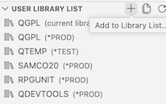
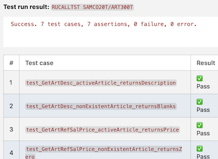

# Lab 106: Generate RPGUnit Tests for SAMCO

## Overview
Use `generate_rpg_unit_test_stub` to scaffold test cases for exported procedures in the `ART300` service program module, fill in test logic, and run the tests with code coverage against `SAMCOn`.

**NOTE:** PPI includes workflows that automates the whole 'Test Generation' process, described here in this lab. The goal of this document is to show how to generate unit tests with Bob, with a few iterations and adjustments but in a real environment, use the appropriate Bob Worflow. 

**Duration**: 20 minutes  
**Difficulty**: Intermediate  
**Mode**: ℹ️ IBM i Developer  
**Source**: Local workspace (`SAMCO/QRPGLESRC/`)  
**Build target**: `SAMCOn` / `SAMCOnT`

> **Local workspace**: Bob reads the source file from the **local Git clone**. Test stubs are written to the workspace. The test suite is compiled and run against `SAMCOn`.

---

## Prerequisites
- Bob IDE with **IBM Bob Premium Package for i** installed
- **Code for IBM i** extension connected to your IBM i system
- `SAMCOn` in your library list — RPGUnit library also required
- [Lab 101](lab101-premium-discover-samco.md) completed (business rules context)

### Install RPGUnit

1. **Install IBM i Testing Extension**
   - Open VS Code Extensions
   - Search for "IBM i Testing"
   - Click Install

2. **Install RPGUnit Component to IBM i**
   - Open Code for IBM i connection settings
   - Navigate to "Components" tab
   - Click "Add Component"
   - Select "RPGUnit"
   - Click Install

3. **Update Library List**

Update library list to: SAMCOn, SAMCOnT (to be created), RPGUNIT, QDEVTOOLS



## Development Approach

This lab uses a hybrid approach combining modern IFS-based source management with traditional IBM i testing:

**Why This Approach?**
- **Application Source in IFS**: Enables Git integration and modern development workflows
- **Test Members in Library**: RPGUnit's `generate_rpg_unit_test_stub` tool requires IBM i members
- **Separate Test Library**: Isolates test code from production, never deploy tests to production

### Source Code Location
```
IFS (Integrated File System)
└── /home/<USERNAME>/builds/IBM-i-Application-Modernization-with-Bob/  ← Workspace root
        └── SAMCO/                                       ← Application source
            ├── QRPGLESRC/
            │   └── ART300-Function_Article.RPGLE       ← Service program source
            └── QDDSSRC/
                └── ARTICLE-Article_File.PF             ← Database definitions
```

### Test Code Location
```
IBM i Libraries (QSYS)
└── SAMCOnT/                                          ← Test library
    └── QTESTSRC/                                       ← Test source file
        └── ART300T.SQLPRGLE                                ← Test suite member
```

### Library Organization

```
┌─────────────────────────────────────────────────┐
│ SAMCOn          → Application library           │
│                   (*PGM, *SRVPGM, *FILE)        │
├─────────────────────────────────────────────────┤
│ SAMCOnT → Test library                          │
│  QTESTSRC                (*SRVPGM for tests)    │
├─────────────────────────────────────────────────┤
│ RPGUNIT         → RPGUnit framework             │
│ QDEVTOOLS       → Development tools             │
└─────────────────────────────────────────────────┘
```

### Naming Conventions

| Type | Example | Location |
|------|---------|----------|
| Application Source | `ART300-Function_Article.RPGLE` | IFS: `SAMCO/QRPGLESRC/` |
| Application Object | `ART300` (*SRVPGM) | Library: `SAMCO1` |
| Test Source | `ART300T.rpgle` | Library: `SAMCO1T/QTESTSRC` |
| Test Object | `ART300T` (*SRVPGM) | Library: `SAMCO1` |
---

## Step 1: Identify Exported Procedures (3 minutes)

**Switch to ℹ️ IBM i Developer mode** in the Bob chat panel.

**Prompt:**
```
Read SAMCO/QRPGLESRC/ART300-Function_Article.RPGLE.

Identify all exported procedures: name, parameters (type and usage), return type, and purpose. Summarize as a table.
```

**What to observe:**
- Bob reads the local workspace file
- The `rpg-procedures-functions` skill is auto-loaded
- Returns the full procedure inventory — key exported procedures: `GetArtDesc`, `GetArtRefSalPrice`, `GetArtStockPrice`, `GetArtFam`, `GetArtStock`, `ExistArt`, `IsArtDeleted`

---

## Step 2: Generate RPGUnit Test Stubs (4 minutes)

**Prompt:**
```
Generate RPGUnit test stubs for GetArtDesc, GetArtRefSalPrice, and ExistArt from  Source member: /SAMSRC/QRPGLESRC/ART300.rpgle
Focus on these procedures: GetArtDesc, GetArtRefSalPrice, GetArtStockPrice. SAMSRC is in QSYS.

Use generate_rpg_unit_test_stub. Show the recommended storage location and generated stub code.
```

**What to observe:**
- Bob calls `generate_rpg_unit_test_stub` — reads exported signatures from the local file
- Generates scaffold with correct includes, prototypes, and empty test procedures

---

## Step 3: Fill In Test Logic (6 minutes)

**Prompt:**
```
Based on the SAMCO business rules from Lab 101:
- GetArtDesc returns ARDESC for a given ARID
- ExistArt returns *On if the article exists and is not soft-deleted (ARDEL ≠ 'X')
- GetArtRefSalPrice returns ARSALEPR for a given ARID

Fill in test assertions for each procedure — one positive test and one negative test per procedure. Use the existing sample data in SAMCOn.
```

**What to observe:**
- Bob fills in `AssertEquals` / `AssertNotEquals` assertions using actual field names from `SAMREF.PF`

**Prompt:**
```
Write the completed test suite to library SAMCO20T file QTESTSRC member ART300T.SQLRPGLE
```

---

## Step 4: Compile the Test Suite (3 minutes)

Confirm that you want to compile the test suite or use a prompt like: 

**Prompt:**
```
Get compile actions for SAMCOnT/QTESTSRC/ART300T.SQLRPGLE and compile it to SAMCOnT. before compiling Add /QSYS.LIB/RPGUNIT.LIB/QINCLUDE.FILE and IFS path SAMCO/QPROTOSRC to INCDIR.
```

**What to observe:**
- Bob uses `get_compile_actions` then `execute_compile_action`
- If the RPGUNIT library is missing from the library list, Bob will flag it

Common issues:
- Prototype mismatch — Bob adjusts parameter types to match actual exported signatures
- `COMMIT(*NONE)` required in SQL test setup — Bob adjusts automatically

---



## Step 5: Run the Tests with Code Coverage (4 minutes)

**Prompt:**
```
Run the RPGUnit test suite SAMCOnT/QTESTSRC/ART300 with *LINE code coverage. Show test results, coverage percentage, and any failures with details.
```

**What to observe:**
- Bob uses `run_rpg_unit_test_suite` with `codeCoverage="*LINE"`
- Returns pass/fail per test procedure and line coverage percentage

**If tests fail:**
```
Explain the failure and identify the correct expected value from the ART300 implementation.
```

---

## ✅ Success Criteria

- [ ] Exported procedures in `ART300-Function_Article.RPGLE` identified from local workspace
- [ ] Test stubs generated with `generate_rpg_unit_test_stub` and saved to `SAMCO/QTESTSRC/`
- [ ] Positive and negative test assertions filled in for `GetArtDesc`, `GetArtRefSalPrice`, `ExistArt`
- [ ] Test suite compiled in `SAMCOn`
- [ ] Tests run with `*LINE` code coverage — results interpreted

---

## Key Takeaways

- `generate_rpg_unit_test_stub` reads real procedure signatures — no type guessing
- Business rules documented in Lab 101 directly feed test assertions
- `*LINE` coverage identifies untested paths in service program logic
- Tests live in the Git repo (`SAMCO/QTESTSRC/`) — shareable across the team

---
